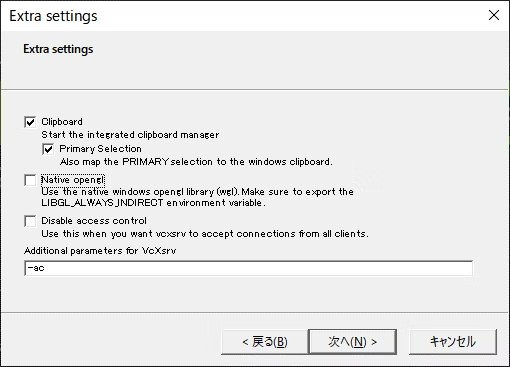
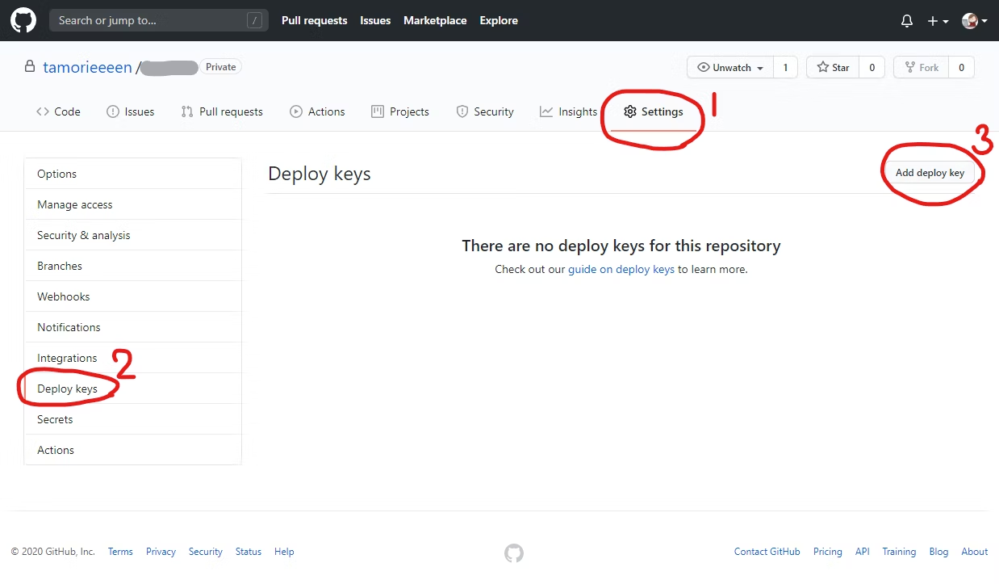

# 作業メモ

### 環境構築

``` console
   $ conda create --name py312 python=3.12
   $ conda activate py312
   $ conda install numpy seaborn pandas
   $ conda install matplotlib
   $ conda install -n py312 ipykernel
```

```
$ pip freeze
absl-py==2.2.2
ale-py==0.11.0
asttokens @ file:///croot/asttokens_1743630435401/work
Bottleneck @ file:///croot/bottleneck_1731058641041/work
box2d-py==2.3.5
Brotli @ file:///croot/brotli-split_1736182456865/work
cffi==1.17.1
chex==0.1.89
cloudpickle==3.1.1
comm @ file:///croot/comm_1709322850197/work
contourpy @ file:///croot/contourpy_1732540045555/work
cycler @ file:///tmp/build/80754af9/cycler_1637851556182/work
Cython==0.29.37
debugpy @ file:///croot/debugpy_1736267418885/work
decorator @ file:///opt/conda/conda-bld/decorator_1643638310831/work
dezero==0.0.13
etils==1.12.2
executing @ file:///opt/conda/conda-bld/executing_1646925071911/work
Farama-Notifications==0.0.4
fasteners==0.19
filelock==3.18.0
flax==0.10.6
fonttools @ file:///croot/fonttools_1737039080035/work
fsspec==2025.3.2
glfw==2.9.0
gymnasium==1.1.1
humanize==4.12.2
imageio==2.37.0
imageio-ffmpeg==0.6.0
importlib_resources==6.5.2
ipykernel @ file:///croot/ipykernel_1737660677549/work
ipython==9.2.0
ipython_pygments_lexers @ file:///croot/ipython_pygments_lexers_1744753235686/work
jax==0.6.0
jaxlib==0.6.0
jedi @ file:///croot/jedi_1733987392413/work
Jinja2==3.1.6
jupyter_client @ file:///croot/jupyter_client_1737570961872/work
jupyter_core @ file:///croot/jupyter_core_1718818295206/work
kiwisolver @ file:///croot/kiwisolver_1737039087198/work
markdown-it-py==3.0.0
MarkupSafe==3.0.2
matplotlib==3.10.0
matplotlib-inline==0.1.7
mdurl==0.1.2
mkl-service==2.4.0
mkl_fft @ file:///io/mkl313/mkl_fft_1730824109137/work
mkl_random @ file:///io/mkl313/mkl_random_1730823916628/work
ml_dtypes==0.5.1
moviepy==2.1.2
mpmath==1.3.0
msgpack==1.1.0
mujoco==3.3.2
mujoco-py==2.1.2.14
nest-asyncio @ file:///croot/nest-asyncio_1708532673751/work
networkx==3.4.2
numexpr @ file:///croot/numexpr_1730215937391/work
numpy @ file:///croot/numpy_and_numpy_base_1742570410886/work/dist/numpy-2.2.4-cp312-cp312-linux_x86_64.whl#sha256=cd87ab48437abde52205a952c8a8e67f54f7a68985c0130688c5bdbeaf055dfc
nvidia-cublas-cu12==12.6.4.1
nvidia-cuda-cupti-cu12==12.6.80
nvidia-cuda-nvrtc-cu12==12.6.77
nvidia-cuda-runtime-cu12==12.6.77
nvidia-cudnn-cu12==9.5.1.17
nvidia-cufft-cu12==11.3.0.4
nvidia-cufile-cu12==1.11.1.6
nvidia-curand-cu12==10.3.7.77
nvidia-cusolver-cu12==11.7.1.2
nvidia-cusparse-cu12==12.5.4.2
nvidia-cusparselt-cu12==0.6.3
nvidia-nccl-cu12==2.26.2
nvidia-nvjitlink-cu12==12.6.85
nvidia-nvtx-cu12==12.6.77
opencv-python==4.11.0.86
opt_einsum==3.4.0
optax==0.2.4
orbax-checkpoint==0.11.12
packaging @ file:///croot/packaging_1734472117206/work
pandas @ file:///croot/pandas_1732735089971/work/dist/pandas-2.2.3-cp312-cp312-linux_x86_64.whl#sha256=57b66702d418720ec8483f7c4ec7c08d41815316ad7ce09d5b7bbc34eefcfdfd
parso @ file:///croot/parso_1733963305961/work
pexpect==4.9.0
pillow==10.4.0
platformdirs @ file:///croot/platformdirs_1744273042065/work
proglog==0.1.11
prompt-toolkit @ file:///croot/prompt-toolkit_1704404351921/work
protobuf==6.30.2
psutil @ file:///croot/psutil_1736367091698/work
ptyprocess @ file:///tmp/build/80754af9/ptyprocess_1609355006118/work/dist/ptyprocess-0.7.0-py2.py3-none-any.whl
pure-eval @ file:///opt/conda/conda-bld/pure_eval_1646925070566/work
pycparser==2.22
pygame==2.6.1
Pygments @ file:///croot/pygments_1744664109463/work
PyOpenGL==3.1.9
pyparsing @ file:///croot/pyparsing_1731445506121/work
PyQt6==6.7.1
PyQt6_sip @ file:///croot/pyqt-split_1744804475988/work/pyqt_sip
python-dateutil @ file:///croot/python-dateutil_1716495738603/work
python-dotenv==1.1.0
pytz @ file:///croot/pytz_1713974312559/work
PyYAML==6.0.2
pyzmq @ file:///croot/pyzmq_1734687138743/work
rich==14.0.0
scipy==1.15.2
seaborn @ file:///croot/seaborn_1741185878286/work
setuptools==72.1.0
simplejson==3.20.1
sip @ file:///croot/sip_1738856193618/work
six @ file:///croot/six_1744271502820/work
stack-data @ file:///opt/conda/conda-bld/stack_data_1646927590127/work
swig==4.3.1
sympy==1.14.0
tensorstore==0.1.74
toolz==1.0.0
torch==2.7.0
tornado @ file:///croot/tornado_1733960490606/work
tqdm==4.67.1
traitlets @ file:///croot/traitlets_1718227057033/work
treescope==0.1.9
triton==3.3.0
typing_extensions==4.13.2
tzdata @ file:///croot/python-tzdata_1690578112552/work
unicodedata2 @ file:///croot/unicodedata2_1736541023050/work
wcwidth==0.2.13
wheel==0.45.1
zipp==3.21.0
```


### WSL2 + Ubuntu環境にてGUIを利用可能にする

https://qiita.com/nishiys/items/3b8c1670891f745c5a81

https://qiita.com/haraken_qiita/items/6983d0ca8c0f76bd021a

### 1. VcXsrvをインストール

https://sourceforge.net/projects/vcxsrv/
vcxsrv-64.1.20.14.0.installer.exe

#### VcXsrvの設定
xlaunch.exeという実行ファイルがあると思いますので, 起動します.

multiple window を選んで, 次へを選択
start no client を選んで, 次へを選択

clipboard を使用したければ, clipboardにチェックを入れます.
Additional parameters for VcXsrv という入力フォームに -ac と入力して, 次へを選択します.



設定内容を`C:\Program Files\VcXsrv\config.xlaunch`に保存。

#### VcXsrvの自動起動設定

Explorerにてshell:startupを開く。
ショートカットの登録→ターゲット
```
C:\Program Files\VcXsrv\xlaunch.exe" -run "C:\Program Files\VcXsrv\config.xlaunch"
```
として登録


### 2. 環境変数の設定
WSL2からVcXsrvに対して画面出力できるようにする。

``` shell
$ vi ~/.bashrc

# 末尾に以下を登録して保存
# Show GUI to windows from WSL2
export DISPLAY=`hostname`.mshome.net:0.0
export LIBGL_ALWAYS_INDIRECT=1
```

### 3. テストスクリプト生成

tkTest.pyとして保存。

``` python
from tkinter import *

root = Tk()
a = Label(root, text ="Hello World")
a.pack()

root.mainloop()

```

`$ python tkTest.py`でスクリプト実行

下記画面が出力されれば終了


### GUI


#### 1. qtwayland5のインストール
```
$ sudo apt install qtwayland5
```

#### 2. `/etc/environment`に下記を追加

```shell
QT_QPA_PLATFORM="xcb"
```


#### 3. `~/.bashrc`に下記を追加

``` shell
export QT_XCB_GL_INTEGRATION=none

```


## GitHubへのpush

### リポジトリのクローン
SSH接続にてpushするため、SSHでcloneすること。

``` shell
$ git clone git@github.com:fff-yokubo/deep-learning-from-scratch-4.git DL4
```

### SSHでp

下記手順参照

https://qiita.com/tamorieeeen/items/c24f8285448b607b12dd

#### 1. 公開鍵+秘密鍵生成

``` console
# .sshディレクトリを作成。パーミッション700に設定

$ mkdir .ssh
$ chmod 700 .ssh/
$ cd .ssh

// id_rsa_githubという名前で鍵を作成

$ ssh-keygen -t rsa
Generating public/private rsa key pair.
Enter file in which to save the key (/home/yuta/.ssh/id_rsa):
Enter passphrase (empty for no passphrase):
Enter same passphrase again:
Your identification has been saved in /home/yuta/.ssh/id_rsa
Your public key has been saved in /home/yuta/.ssh/id_rsa.pub
The key fingerprint is:
xxxxxxxxxxxxxxxxxxxxxxxxxxxxxxxx

$ cat id_rsa.pub
# コピー。
ssh-rsa AAAAB3NzaC1yc2EAAAADAQABAAABgQDPhoJzYDVYHDYZhEjOUS49XtyPDSzCbijFUu8yQjp51W1P7Gg1urOLw4FTvnK4BlR1nIODcKEOCnlIUBAyYIQg
PxIbmN9DbtXh5f+SO/MF36FwyyuinAYqcGGgll4KLqvQ5srBKLP8gCeix9aVsoJceZYHnAQXg2HbFYCig0gkQ5dVySw6BL0C624Z166ICHpfyBlaaQwpCkewJ/cP
2Tp4ncZb9hEqssPVLs/9UCY5zIrt5YanDAoIlR22jEi5FC5XfVAQEua+/QenjzdU2Rw2/IgDsYKr7Zs3BfSLXNBfqZ6lJZBkdnaUFIpXvIrhPY4Eh8ZND2h8Fg8L
vFebjcHUjB2JvwqItWePtSmkELY/02+UK5XwLS1vt9kPF8ueZdaBZWOxK3dgoUCKiFo7y7Q1IICtfpdHEJ6jdDYk7Rp24EndnGujSbyks5ESjU1o20hVu/fz/UoA
bUxykrvadMNGcXYD3o3oWPRKUNMKi8DypATSIr/rsLtGscWys7rWziE= yuta@yusokoso
```

### 2. GitHubに公開鍵を生成

登録したいリポジトリの Settings > Deploy keys > Add deploy key からさっき作った公開鍵を登録する



Keyに上記でコピーした公開鍵を貼り付けてAdd Key。

### 3. push実行

リモートリポジトリ-ブランチokb(新規作成)してpush
``` console
$ git push origin HEAD:okb
Enumerating objects: 9, done.
Counting objects: 100% (9/9), done.
Delta compression using up to 16 threads
Compressing objects: 100% (7/7), done.
Writing objects: 100% (7/7), 30.29 KiB | 15.15 MiB/s, done.
Total 7 (delta 2), reused 0 (delta 0), pack-reused 0
remote: Resolving deltas: 100% (2/2), completed with 2 local objects.
remote:
remote: Create a pull request for 'okb' on GitHub by visiting:
remote:      https://github.com/fff-yokubo/deep-learning-from-scratch-4/pull/new/okb
remote:
To github.com:fff-yokubo/deep-learning-from-scratch-4.git
 * [new branch]      HEAD -> okb

```